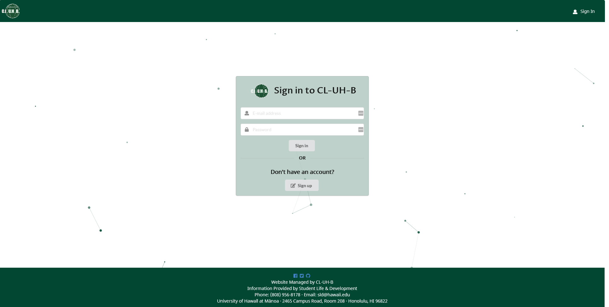
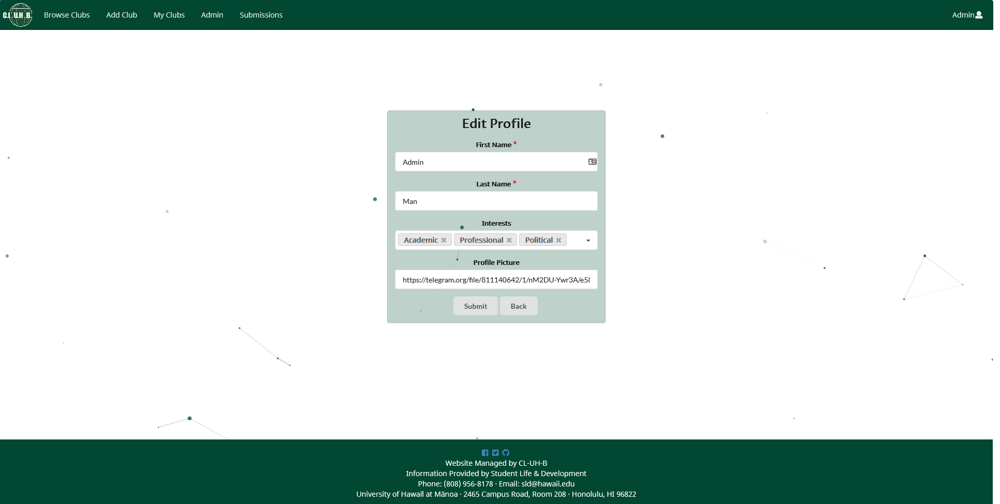
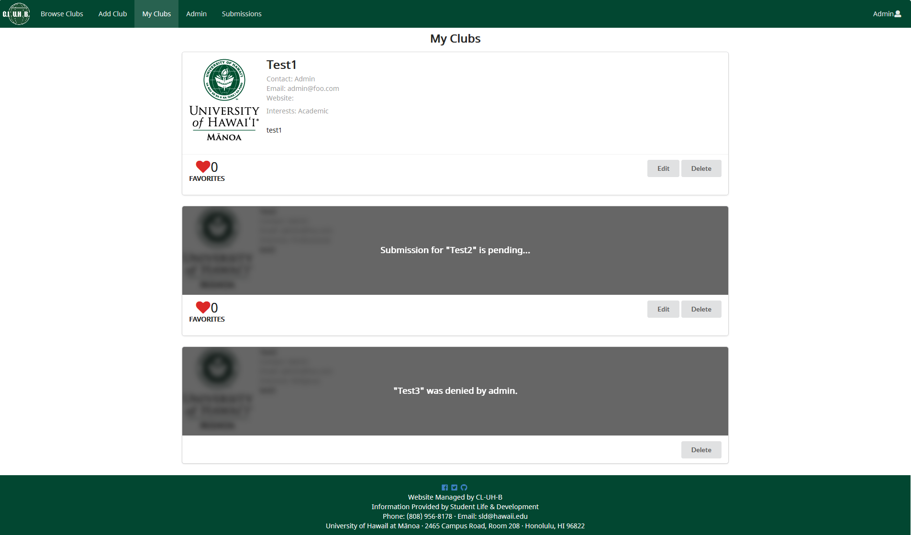
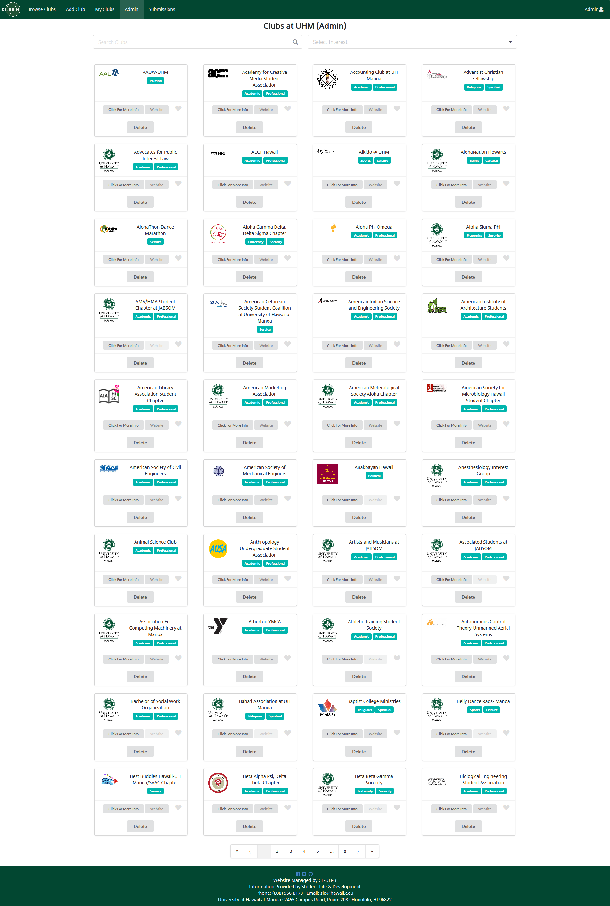
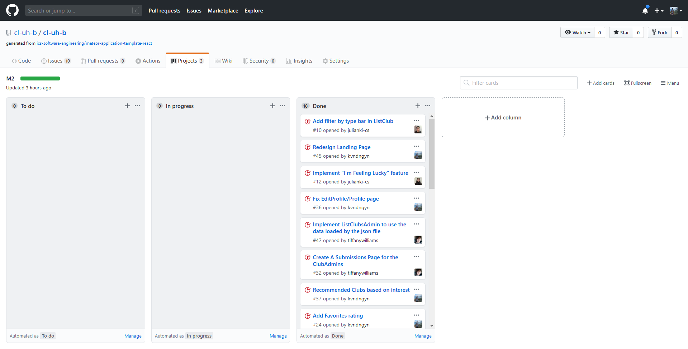

## Table of Contents
* [Overview](#overview)
* [User Guide](#user-guide)
* [Community Feedback](#community-feedback)
* [Developer Guide](#developer-guide)
* [Development History](#development-history)
* [The Developers](#the-developers)

## Overview
[CL-UH-B](http://cluhb.meteorapp.com/#/) is a website for students at the University of Hawaii at Manoa to find clubs to join. Manoa students can login to browse a well organized directory of all current student clubs, with brief descriptions, meeting times and locations, URLs to their websites (if any), contact information for officers, and a few select photos. The application uses various technologies including: 
* [Meteor](https://www.meteor.com) for Javascript-based implementation of client and server code.
* [React](https://reactjs.org) for component-based UI implmentation and routing
* [Semantic UI React](https://react.semantic-ui.com) CSS Framework for UI design
* [Uniforms](htttps://uniforms.tools) for React and Semantic UI-based form design and display

## User Guide
This section provides a walkthrough of the CL-UH-B user interface and its capabilites. You may get to the direct site by clicking on the section header. 
*Note: You will need to be logged into the correct accounts for certain pages.

### [Landing Page](http://cluhb.meteorapp.com/#/)
The first page that students will see upon visiting the site.


### [Sign in & Sign up](http://cluhb.meteorapp.com/#/signin)
This page is where users can sign in or sign up.


### [Browse Clubs](http://cluhb.meteorapp.com/#/browse)
This page allows students to search and filter for clubs.


### [I'm Feeling Lucky!](http://cluhb.meteorapp.com/#/im-feeling-lucky)
This page randomly shows a club based on the user's interest.


## [Profile](http://cluhb.meteorapp.com/#/profile)
This page lets users see their account information, favorites...


and recommends clubs based on interest.


## [Edit Profile](http://cluhb.meteorapp.com/#/profile)
This page lets users edit basic account information


### [Add Club](http://cluhb.meteorapp.com/#/add)
This page allows user's to add clubs if theirs is not listed.


### [My Clubs](http://cluhb.meteorapp.com/#/my-clubs)
This page allows club owners to quick view their club and ratings.


### [Edit Club](http://cluhb.meteorapp.com/#/my-clubs)
This page allows club owners to make edits to their club.


### [Admin](http://cluhb.meteorapp.com/#/admin)
This page allows admins to quickly review and delete clubs.


### [Submissions](http://cluhb.meteorapp.com/#/submissions)
This page allows admins to either accept or deny club request.


## Community Feedback
There always imporvements that can be made, please share your feedback [here](https://forms.gle/tP18KSG3wHUXM87B9)! We would like to gather how users feel about the system so that we can further improve it and make it better to use.

## Developer Guide
This section provides information of interest to Meteor developers wishing to use this code base as a basis for their own development tasks.

### Installation

First, [install Meteor](https://www.meteor.com/install).

Second, visit the [CL-UH-B Application Repo](https://github.com/cl-uh-b/cl-uh-b), and fork the repo or download the ZIP file.

Third, cd into the cl-uh-b/app directory and install libraries with:

```
$ meteor npm install
```

Fourth, run the system with:

```
$ meteor npm run start
```

If all goes well, the application will appear at [http://localhost:3000](http://localhost:3000).

### Application Design

CL-UH-B is based upon [meteor-application-template-react](https://ics-software-engineering.github.io/meteor-application-template-react/) and [meteor-example-form-react](https://ics-software-engineering.github.io/meteor-example-form-react/). Please use the videos and documentation at those sites to better acquaint yourself with the basic application design and form processing in CL-UH-B.

## Initialization

The [config](https://github.com/cl-uh-b/cl-uh-b/tree/master/config) directory is intended to hold settings files.  The repository contains one file: [config/settings.development.json](https://github.com/cl-uh-b/cl-uh-b/blob/master/config/settings.development.json).

This file contains default definitions for Profiles and Clubs.
 
The settings.development.json file contains a field called "loadAssetsFile". This allows us to use the club.json file to load all the club data.


## Quality Assurance

### ESLint

CL-UH-B includes a [.eslintrc](https://github.com/bowfolios/bowfolios/blob/master/app/.eslintrc) file to define the coding style adhered to in this application. You can invoke ESLint from the command line as follows:

```
meteor npm run lint
```

ESLint should run without generating any errors.

It's significantly easier to do development with ESLint integrated directly into your IDE (such as IntelliJ).

### From mockup to production

CL-UH-B is meant to illustrate the use of Meteor for developing an initial proof-of-concept prototype.  For a production application, several additional security-related changes must be implemented:

* Use of email-based password specification for users, and/or use of an alternative authentication mechanism.
* Use of https so that passwords are sent in encrypted format.
* Removal of the insecure package, and the addition of Meteor Methods to replace client-side DB updates.

## Development History

### Goals
Below are the goals for CL-UH-B (06 April 2020): 
* To create a visually appealing website with a simple user interface (UI) that anyone can navigate
* Implement the three users (student, club contact, admin)
* Ability to add/edit clubs
* Filter clubs to specific interest(s)
* Importing the current RIO spreadsheet into the club database
* User can add/remove interest to their profile to view clubs for them in "Clubs for You!" page 
* A "I'm feeling lucky!" button

You may check out [CL-UH-B here](http://cluhb.meteorapp.com/#/).

The development process for CL-UH-B conformed to [Issue Driven Project Management](http://courses.ics.hawaii.edu/ics314f19/modules/project-management/) practices. In a nutshell:

* Development consists of a sequence of Milestones.
* Each Milestone is specified as a set of tasks.
* Each task is described using a GitHub Issue, and is assigned to a single developer to complete.
* Tasks should typically consist of work that can be completed in 2-4 days.
* The work for each task is accomplished with a git branch named "issue-XX", where XX is replaced by the issue number.
* When a task is complete, its corresponding issue is closed and its corresponding git branch is merged into master.
* The state (todo, in progress, complete) of each task for a milestone is managed using a GitHub Project Board.

The following sections document the development history of CL-UH-B.

### Milestone 1: Mockup and Deployment
The goal of Milestone 1 was to deploy our system to [Galaxy](https://galaxy.meteor.com/) with a completed landing page and mockups. You can find our [Project Board M1 here](https://github.com/cl-uh-b/cl-uh-b/projects/1). You may view the [mockups here](doc/mockups).


### Milestone 2: Functionality Improvements
The goal of Milestone 2 was to improve on the functionality of our mockups. You can find our [Project Board M2 here](https://github.com/cl-uh-b/cl-uh-b/projects/2).



### Milestone 3
The goal of Milestone 3 was to significantly improve our system and gain feedback. You can find our [Project Board M3 here](https://github.com/cl-uh-b/cl-uh-b/projects/3).


## The Developers
All developers are current ICS students at the University of Hawaii at Manoa and have their foundation built from courses taken here.
* [Julian Kim](https://github.com/julianki-cs) 
* [Anh Le](https://github.com/lekanh)
* [Kevin Nguyen](https://github.com/kvndngyn)
* [Tiffany Williams](https://github.com/tiffanywilliams)


