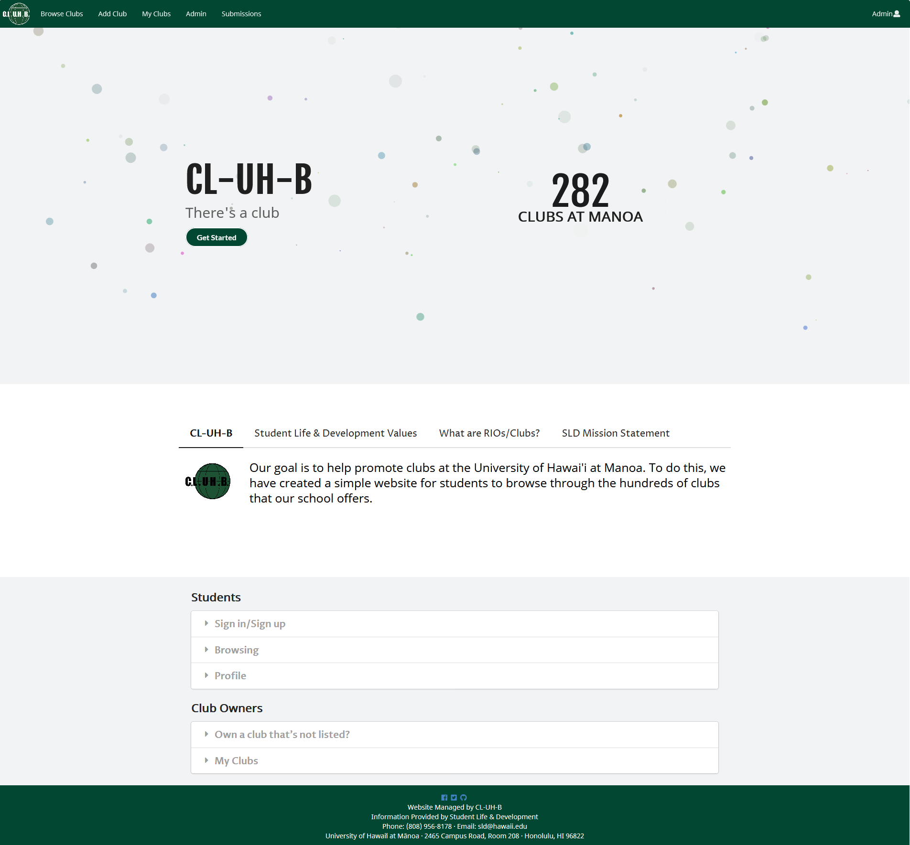

## Table of Contents
* [Overview](#overview)
* [User Guide](#user-guide)
* [Community Feedback](#community-feedback)
* [Developer Guide](#developer-guide)
* [Development History](#development-history)
* [The Developers](#the-developers)

## Overview
CL-UH-B is a website for students at the University of Hawaii at Manoa to find clubs to join. Manoa students can login to browse a well organized directory of all current student clubs, with brief descriptions, meeting times and locations, URLs to their websites (if any), contact information for officers, and a few select photos.

## User Guide
This section provides a walkthrough of the CL-UH-B user interface and its capabilites.

### Landing Page
The first page that students will see upon visiting the site.

## Community Feedback

## Developer Guide

## Development History
### Goals
Below are the goals for CL-UH-B (06 April 2020): 
* To create a visually appealing website with a simple user interface (UI) that anyone can navigate
* Implement the three users (student, club contact, admin)
* Ability to add/edit clubs
* Filter clubs to specific interest(s)
* Importing the current RIO spreadsheet into the club database
* User can add/remove interest to their profile to view clubs for them in "Clubs for You!" page 
* A "I'm feeling lucky!" button

### Milestone 1: Mockup and Deployment
The goal of Milestone 1 was to deploy our system to [Galaxy](https://galaxy.meteor.com/) with a completed landing page and mockups. You can find our [Project Board M1 here](https://github.com/cl-uh-b/cl-uh-b/projects/1).

#### Mockups
The following are mockups of Browse Clubs and I'm Feeling Lucky in their respective order.

### Milestone 2
### Milestone 3

## The Developers
* [Julian Kim](https://github.com/julianki-cs)
* [Anh Le](https://github.com/lekanh)
* [Kevin Nguyen](https://github.com/kvndngyn)
* [Tiffany Williams](https://github.com/tiffanywilliams)

